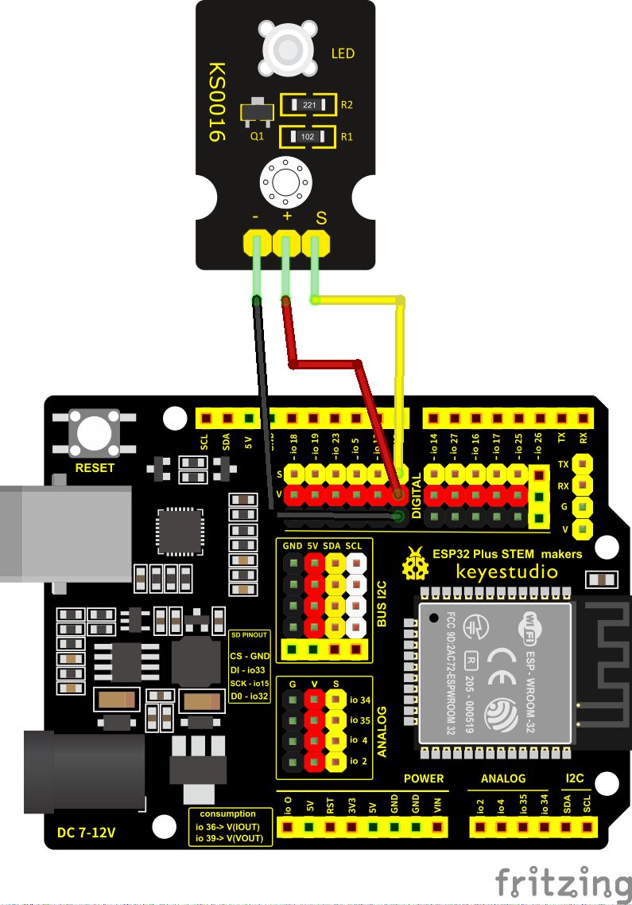

## NanoReto 1 – Ejemplo 1

En este ejemplo es un LED que parpadea cada segundo.

El programa usa el pin digital 12 como salida para controlar el LED. En el bloque `setup()` se configura ese pin, y en el bloque `loop()` se enciende (`HIGH`), se espera un segundo, se apaga (`LOW`) y se vuelve a esperar otro segundo. Esto se repite continuamente, haciendo que el LED parpadee.

El montaje físico está representado en el esquemático. Solo necesitas un LED.

