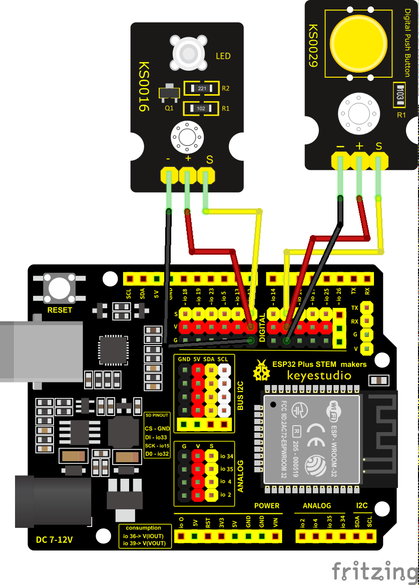

## NanoReto 2 – Ejemplo 1

En este ejemplo se controla un LED mediante un botón. El LED solo se enciende cuando se mantiene presionado el botón.

El programa utiliza el pin digital 12 como salida para el LED y el pin 27 como entrada para el botón. En `setup()`, se configura el LED como salida y el botón como entrada con resistencia pull-up interna. En `loop()`, se revisa si el botón está presionado (`LOW`) y, de ser así, se enciende el LED; de lo contrario, permanece apagado.

El montaje físico está representado en el esquemático. Solo necesitas un botón y un LED con su resistencia.

