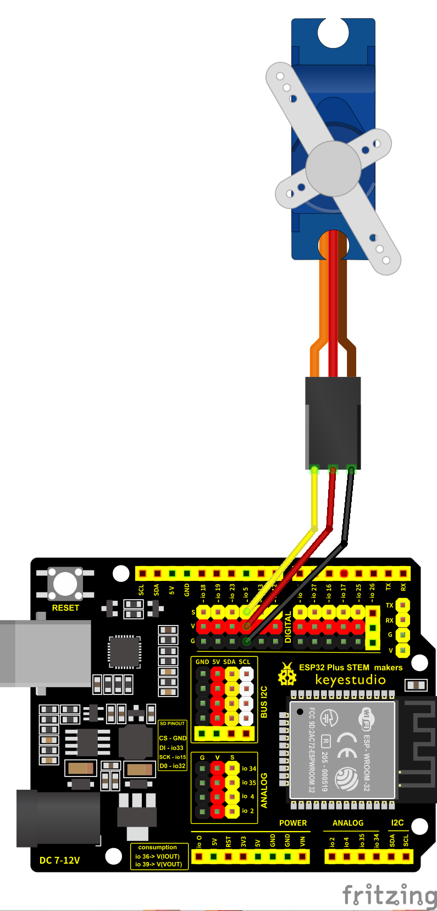

## NanoReto 4 – Ejemplo 1

En este ejemplo se utiliza un microservo controlado desde un ESP32 mediante la librería `ESP32Servo`. El servo se moverá automáticamente entre tres posiciones: 0°, 90° y 180°, con una pausa de 1 segundo entre cada movimiento.

El servo está conectado al pin GPIO 5 del ESP32.

